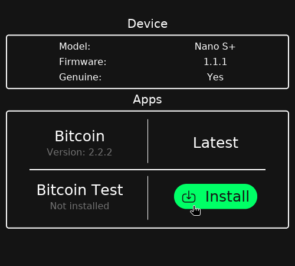

<div align="center">

*Brought to you by*

  <a href="https://wizardsardine.com" target="_blank">
    
  </a>

</div>

# Bacca

Your Ledger companion.

**WARNING: this is alpha software. Only use for testing.**

A minimalistic software to install and upgrade the Bitcoin application on Ledger Nano S, S plus and
X.



## Why?

Ledger makes great hardware. However their software is lacking.

The Ledger Nano S plus and X are secure, user-friendly and up to date with the latest Bitcoin
technologies. They are securely accessible to beginners, while letting their users benefit from
advancements and newer standards.

Ledger Live is a cluttered software to manage your device where development resources are allocated
toward scammy altcoins instead of making a decent Bitcoin wallet. The trajectory taken by Ledger
Live has become increasingly worrying to me and other users of Liana: will my beneficiaries at all
be able to navigate through the nudges toward Ponzi schemes and go through the unnecessary
complicated procedure of setting up their device to be used with a Bitcoin wallet?

This software offers a simple, straight-to-the-point, alternative.

The state of this project is nowhere near the point where it can stably replace Ledger Live for
non tech-savvy bitcoiners, yet. That said we hope to start pulling some of the functionalities into
[Liana](https://github.com/wizardsardine/liana).


## Usage

**This is a PoC. Use at your own risk.**

This software can be used:
1) Through a Graphical User Interface
2) Through a Command Line Interface
3) Through a Rust library for other projects to integrate some of the functionalities

### GUI

The recommended way to use this software is through the GUI. Simply connect your Ledger Nano S, S
plus or X to the USB port and run:
```
cargo run -p ledger_manager_gui
```

We plan on releasing binaries in the future.

### CLI

Another way of using this is the CLI, which directly hooks up into the functionalities offered by
the Rust crate. The CLI will talk to a Ledger device connected by USB. The commands are communicated
using an environment variable, `LEDGER_COMMAND`. Another env var lets you switch to testnet (for
instance to install the test app), simply set `LEDGER_TESTNET` to any value.

For now those commands are implemented:
- `getinfo`: get information (such as the list of installed apps) for your device
- `genuinecheck`: check your Ledger device is genuine
- `installapp`: install the Bitcoin app on your device
- `updateapp`: update the Bitcoin app on your device
- `openapp`: open the Bitcoin app on your device

### Examples

#### Checking your Ledger is genuine

```
LEDGER_COMMAND=genuinecheck cargo run -p ledger_manager_cli
```
```
Querying Ledger's remote HSM to perform the genuine check. You might have to confirm the operation on your device.
Success. Your Ledger is genuine.
```

#### Installing the Bitcoin Test app on your Ledger

```
LEDGER_TESTNET=1 LEDGER_COMMAND=installapp cargo run -p ledger_manager_cli
```
```
Querying installed applications from your Ledger. You might have to confirm on your device.
Querying Ledger's remote HSM to install the app. You might have to confirm the operation on your device.
Successfully installed the app.
```

## Future

We are looking into people to help test this and confirm it works in as many scenarii as possible.

We are probably going to have to introduce an `upgradefirmware` command.

Contributions welcome! If you are interested, get in touch on the [Liana
Discord](https://discord.gg/QJUp67zSN4).

NOTE: i am not interested in supporting altcoins. If you want to add support for one, feel free to
fork the project.
